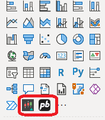

# PI03 - Analytics

### ***********************************************************************************************************************************************************************

# REPORTE DE CALIDAD DE LOS DATOS

### ***********************************************************************************************************************************************************************

## Carga de los datos

Para la resolución del proyecto PI03-analytics, me conecte la API de FTX que “es un exchange, fundado en 2019 y con sede corporativa en Bahamas, en el que traders minoristas e instituciones pueden comprar y vender criptoactivos, tokens apalancados, NFTs, futuros, acciones, acciones tokenizadas y moneda fiduciaria. Además, la compañía también dispone de su propio token: FTT.”( https://cryptoconexion.com/)
La url, de la documentación de la API es: [docs.ftx.com](https://docs.ftx.com/#overview)
Donde podrá entender los requerimientos de acceso necesarias acorde con sus necesidades.

## Exploración, Limpieza Y transformación de los datos

Necesitaba obtener los precios históricos de el top 10 de las criptomonedas según ranking de [coinmarketcap.com ](https://coinmarketcap.com/es/) , para lo cual en la documentación me indicaban lo siguiente: 
GET/markets/{market_name}/candles?resolution={resolution}&start={start_time}&end_time={end_time}
 para lo cual hice uso de la librería [pypi.org]https://pypi.org/project/requests/)de python, donde me disponibilizaron los datos en formato json ; {
  "success": true,
  "result": [
    {
      "close": 11055.25,
      "high": 11089.0,
      "low": 11043.5,
      "open": 11059.25,
      "startTime": "2019-06-24T17:15:00+00:00",
      "volume": 464193.95725
    }
  ]
}, el cual transformé a un Dataframe pandas para su exploración, limpieza y transformación de ser necesario.

En el proceso de exploración de los datos no encontré valores nulos, ni atributos perdidos, todas las variables estaban en inglés, encontré algunos valores atípicos pero que después de un análisis, determiné que hacían parte natural de un entorno de comercio de criptomonedas, donde se sufren fluctuaciones acordes con el movimiento diario del mercado. Para este proceso conserve todas las variables ya que eran necesarias para la hipótesis, donde cada registro contiene el mismo número de campos.
En conclusión, puedo afirmar que se obtuvieron unos datos de muy buena calidad y que requirió de muy poca y casi nula transformación, por lo que procedi a disponivilizarlos para el analisis con el uso de la herramienta Power Bi desktop de Microsoft, donde hice uso de 02 objetos visuale que no estan disponivilizados en la herramienta, correspondiendo a obtenerlo y disponivilizarlos en el panel de visualizaciones

, herramientas utilizada para realizar análisis financiero y grafico de velas muy usado en este entorno con el mismo fin.

